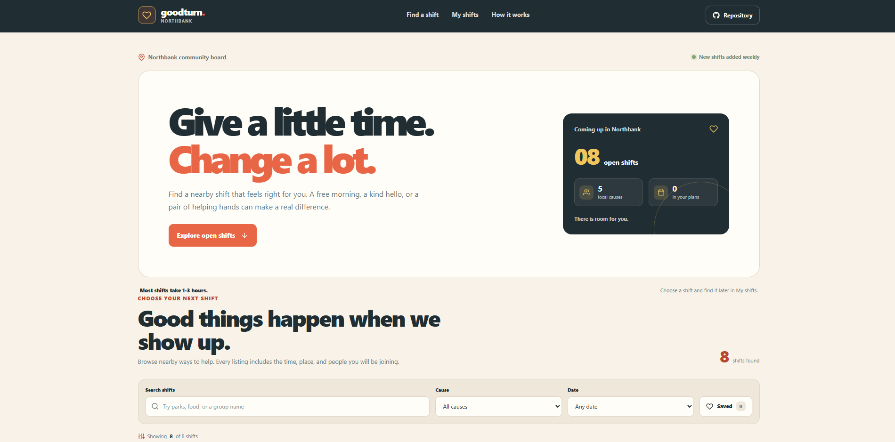

# Goodturn - Volunteer Opportunities

Goodturn is a responsive volunteer opportunity board for finding nearby community shifts and keeping a personal plan. Browse local listings, filter by cause or date, save shifts to revisit, and add sign-ups to **My shifts**.

**Live site:** [https://a2rp.github.io/volunteer-opportunity-board/](https://a2rp.github.io/volunteer-opportunity-board/)

## What is included

- A fixed header with links to opportunities, My shifts, and the usage guide. The links scroll to their sections, and the header also has a mobile menu and a direct link to the public source repository.
- A short overview with the number of available shifts, causes, and shifts in your plan.
- Eight sample opportunities across community, environment, food support, learning, and animal care. Their dates are generated relative to the current date so the listings stay upcoming.
- Locally stored photos for the opportunity cards, with a simple text fallback when a listing does not need a photo.
- Search across shift title, organization, cause, location, and description.
- Cause and date filters, plus a saved-only switch. The date choices include any date, this week, and weekend. A clear action restores the full list.
- Save buttons on opportunity cards. The saved-only switch makes it easy to return to those choices later.
- A sign-up form that collects a name, email, and optional note for the personal plan. It shows the shift date, time, location, and details before saving.
- **My shifts**, with upcoming plans, the volunteer name, optional note, date, start time, location, and total planned hours.
- A custom confirmation dialog before a sign-up is removed from the plan.
- Empty states, status messages for completed actions, keyboard accessible dialogs, and a floating Back to top button after scrolling down.
- A short guide explaining how to choose a shift, save a place, and find the plan again.
- Responsive layouts for desktop and mobile, local favicon and footer logo, and social sharing metadata.

## How it works

The opportunity list is sample data in `src/data/volunteerOpportunities.js`. Dates are calculated from the current day when the app loads. Search and filters only change which cards are shown; clearing them returns all sample opportunities.

Saved opportunity IDs are stored in the browser's `localStorage` under `goodturn-saved-shifts`. Sign-up details are stored under `goodturn-signups`. The app reads these values when it opens, updates them when a shift is saved, added, or removed, and handles missing or invalid saved data by starting with an empty list.

This is a front-end demonstration. Saved shifts and sign-ups stay in the current browser on the current device. Adding a sign-up does not contact the listed organization, reserve a real place, or send the entered email. Clearing the browser's site data removes the saved plan. Use sample details if you are exploring the interface.

## Run locally

Install a current Node.js version, then run these commands from the project folder:

```sh
npm install
npm run dev
```

Vite prints a local address in the terminal. Open that address in a browser to use the app.

## Lint, build, and deploy

```sh
npm run lint
npm run build
npm run deploy
```

The deploy command runs the production build first, then publishes the contents of `dist` to the `gh-pages` branch with `gh-pages`. GitHub Pages serves that branch at [https://a2rp.github.io/volunteer-opportunity-board/](https://a2rp.github.io/volunteer-opportunity-board/). Do not commit `dist` to `main`.

## Future improvements

These are ideas for later work and are not implemented in this project:

- Connect an API so community organizations can publish, edit, and close real shifts.
- Add volunteer accounts and sync plans across devices.
- Send confirmation emails and notify organizations when someone signs up or cancels.
- Keep availability in sync with a shared capacity system and prevent overbooking.
- Add a map view, calendar export, and more detailed accessibility information for each shift.
- Add an organization dashboard for managing listings and reviewing volunteer sign-ups.

## Links

- Portfolio: [https://www.ashishranjan.net](https://www.ashishranjan.net)
- GitHub: [https://github.com/a2rp](https://github.com/a2rp)
- CodePen: [https://codepen.io/ash1198](https://codepen.io/ash1198)
- LinkedIn: [https://www.linkedin.com/in/aashishranjan](https://www.linkedin.com/in/aashishranjan)
- Facebook: [https://www.facebook.com/theash.ashish/](https://www.facebook.com/theash.ashish/)
- YouTube: [https://www.youtube.com/@ashishranjan-ashz?sub_confirmation=1](https://www.youtube.com/@ashishranjan-ashz?sub_confirmation=1)
- Email: [mailto:ash.ranjan09@gmail.com](mailto:ash.ranjan09@gmail.com)

## Support

- Support: [https://a2rp-donation-page.netlify.app/](https://a2rp-donation-page.netlify.app/)
- Buy Me a Coffee: [https://buymeacoffee.com/ashishranjan](https://buymeacoffee.com/ashishranjan)
- Patreon: [https://www.patreon.com/ashishranjan](https://www.patreon.com/ashishranjan)
